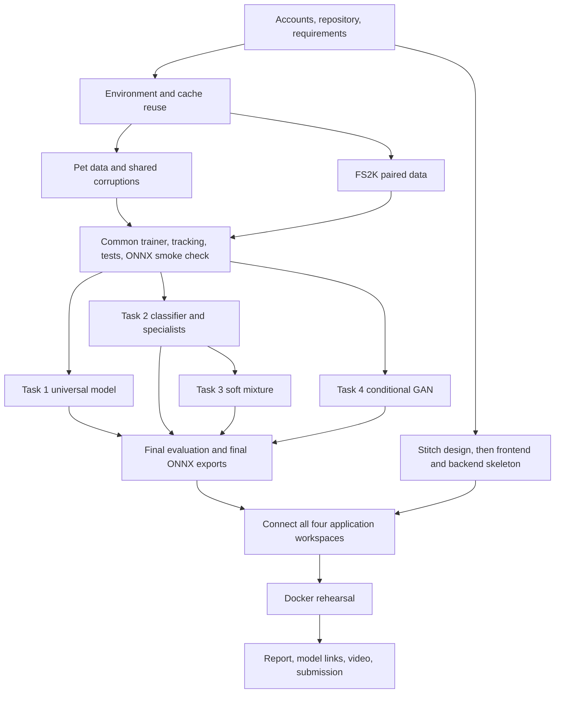

# GenAI Assignment 1 — Complete Execution Plan

**Prepared:** 4 October 2026. **Project:** `D:\i230007_GenAi_A1`.

**Basis:** all nine pages of `GenAI_Assignment#1.pdf`, a read-only audit of relevant software/data on C: and D:, actual Python imports and GPU operations, and the official documentation/research linked throughout this document.

**Status:** planning and environment inspection are complete. The assignment implementation, dataset acquisition, accounts, model training, and application deployment have not been performed. Commands and proposed files below describe future work unless explicitly labelled as verified.

**Account/setup refinement after the prerequisite review:** The user's existing GitHub credential for `SyedAshherMajid` passed a read-only authenticated GitHub API check. No new GitHub account is needed; repository creation/push permissions remain to be confirmed when implementation is authorized. To minimize manual account work, prefer **local MLflow** over W&B and **local automated LaTeX compilation** over an Overleaf account. These choices supersede the account-dependent defaults below; both comply with the PDF. Kaggle's authenticated CLI is the preferred remote-job control path, and Stitch's documented API-key/MCP access can support automated design generation after the user grants access. Use an existing Python 3.11+ interpreter in a separate tools environment for the current Kaggle CLI; keep training on the verified Python 3.10 stack. A Colab notebook link does not give access to its live runtime, and free Colab is an interactive fallback rather than an assumed unattended remote worker. User logins, verification challenges, and later runtime reconnection cannot all be completed in advance. Do not create extra accounts to bypass quotas.

References for this refinement: [Kaggle authentication](https://github.com/Kaggle/kaggle-cli/blob/main/docs/README.md), [Kaggle job commands](https://github.com/Kaggle/kaggle-cli/blob/main/docs/kernels.md), [Stitch MCP setup](https://stitch.withgoogle.com/docs/mcp/setup), [Google-published Stitch SDK](https://github.com/google-labs-code/stitch-sdk), [Tectonic LaTeX installation](https://tectonic-typesetting.github.io/book/latest/installation/), and [Colab resource/access rules](https://research.google.com/colaboratory/faq.html).

**The destination:** one React/Tailwind application with four workspaces, a FastAPI backend performing ONNX inference, Docker Compose startup, reproducible training/evaluation code, recorded experiments, an IEEE LaTeX report, downloadable model files, and a 5–7 minute YouTube demonstration.

**Reading order:** read the decisions and inventory first; complete Phases 0–4; then follow the training dependency diagram. The final sections provide budgets, download decisions, submission checks, and sources.

**Quick navigation:** [Inventory](#2-what-is-already-on-this-laptop) · [Requirements](#3-assignment-requirements-that-cannot-be-traded-away-for-speed) · [Start: Phase 0](#phase-0--confirm-requirements-accounts-and-repository) · [Training infrastructure](#phase-4--build-shared-training-metrics-tracking-and-early-export-checks) · [Parallel compute](#5-free-compute-and-realistic-parallel-execution) · [Budgets](#6-experiment-budget-and-when-to-stop) · [Your workload](#7-practical-calendar-and-your-workload) · [Downloads by phase](#8-phase-by-phase-download-summary) · [First session](#12-first-implementation-session-checklist).

## 1. Decisions that make this efficient

1. **Use PyTorch, not two training frameworks.** A working GPU-compatible installation and its large cached installer already exist.
2. **Use a clean Python 3.10 project environment on D:.** Recover compatible packages from existing caches; keep other projects untouched. Do not mix packages from Python 3.10, 3.13, and 3.14.
3. **Start with compact convolutional models at the required 128 × 128 resolution.** Investigate larger settings through bounded Optuna searches only when validation supports the cost.
4. **Train one local GPU job at a time.** The laptop has 3 GB VRAM. Run the independent face-to-sketch job on one available free cloud GPU while doing local restoration work.
5. **Prefer Kaggle for the first free cloud training attempt; keep Colab as a fallback.** Check the actual account's available accelerator and quota. Neither availability nor completion time is guaranteed.
6. **Use Weights & Biases (W&B) for shared local/cloud experiment records.** It avoids operating a tracking server across machines. If account access is unavailable, choose MLflow before serious training; do not maintain two trackers.
7. **Export a tiny model early.** Confirm ONNX compatibility before spending hours training an architecture.
8. **Keep the application CPU-compatible.** ONNX Runtime CPU inference in Docker avoids requiring the evaluator to configure CUDA. Train outside the application containers.
9. **Reuse code, data splits, corruption logic, metrics, and display components.** Task 2 models must be preserved and copied into Task 3, not overwritten.
10. **Collect report evidence automatically while training.** Write explanations during development rather than trying to reconstruct the entire experiment history at the end.
11. **Use browser tools for Stitch and LaTeX.** No need for a large local TeX distribution, an additional design application, or paid hosting.
12. **Do not add unrelated features.** No login system, payment system, mobile app, database for user uploads, Kubernetes, diffusion model, chatbot, or free-text sketch prompting is needed.

These are implementation choices, not additional instructor requirements. Requirements are explicitly identified below; trial counts, architectures, scheduling, and numerical acceptance thresholds are proposed engineering decisions.

## 2. What is already on this laptop

### 2.1 Audit coverage and limitations

The filename/directory audit visited **40,224 directories and 250,228 files**, identified **15 Python package locations**, and inspected relevant package metadata. Targeted checks also covered pip HTTP caches, npm's cache index, registered Python installations, WSL Ubuntu, GPU operation, Docker commands, and recording applications.

The scan intentionally excluded Windows internals, recycle bins, browser profiles, credentials, Git internals, most package interiors, and reparse points. There were 26 access errors, largely protected OS locations. Archives with unrelated names and Docker image contents were not exhaustively unpacked. Therefore, **“not found” means not found in the inspected relevant locations, not proof that no copy exists anywhere.** No unrelated document contents or credentials were needed.

Supporting local evidence:

- [Environment/package inventory](planning/environment_inventory.json)
- [Cached Python wheels](planning/cached_packages.json)
- [npm cache inventory](planning/npm_cache_inventory.json)
- [Hardware and tools](planning/hardware_and_tools.json)
- [Actual import checks](planning/runtime_import_checks.json)
- [Synthetic GPU checks](planning/gpu_probe_results.json)
- [Read-only scan script](planning/audit_environment.py)

The raw audit contains local machine paths; it is for planning and does not need to be published with the assignment.

### 2.2 Hardware and practical implications

| Item | Verified finding | Decision |
|---|---|---|
| Laptop | ASUS TUF GAMING FX504GM_FX80GM | Use the existing machine |
| CPU | Intel i5-8300H, 4 cores / 8 logical processors | Begin data loading with 0 workers, then benchmark 2; avoid excessive worker processes |
| RAM | About 15.86 GiB usable reported memory, nominally 16 GB | Cache resized clean images compactly; keep Docker stopped during GPU training when not needed |
| GPU | NVIDIA GeForce GTX 1060, **3,072 MiB VRAM** | Compact models and measured batches; one GPU training process |
| CUDA capability | **6.1**, driver **581.42** | Preserve the verified compatible PyTorch build |
| C: free space | About **7.9 GiB** during inspection | Avoid placing datasets, environments, and build caches here |
| D: free space | About **51.0 GiB** during inspection | Store project environment, datasets, artifacts, and downloads here |
| Docker data | Existing `D:\DockerData\disk\docker_data.vhdx`; apparent file size about 24.81 GiB | Already a D: data location exists; verify the active Docker setting before changing anything |

The GTX 1060 is listed by NVIDIA as compute capability 6.1. Do not assume an arbitrary latest CUDA/PyTorch build will support it; our existing build actually did. [NVIDIA GPU reference](https://developer.nvidia.com/cuda/gpus/legacy)

### 2.3 Software inventory and download decisions

| Component | Observed status | Action for this assignment |
|---|---|---|
| Python 3.10.11 | Installed at `C:\Users\ASUS\AppData\Local\Programs\Python\Python310\python.exe` | Reuse to create the project environment; no interpreter download |
| Default `python` | Resolves to `C:\Python314\python.exe` | Do not use this accidentally for training; explicitly select Python 3.10 |
| Other Python | Python 3.14 installations and Anaconda Python 3.13.9 exist | Keep them for their existing projects |
| PyTorch | **2.7.1+cu118** in `D:\Assesment\.venv310` | Verified GPU training operation; reuse its cached wheel |
| torchvision | **0.22.1+cu118**, same environment | Verified import; matching cached wheel available |
| Other PyTorch | 2.6.0+cu124 in `D:\Nastp_Project\venv`; 2.14.0 metadata in another environment | Not the chosen stack; version alone does not prove GPU compatibility |
| NumPy / Pillow / Matplotlib | 2.2.6 / 12.3.0 / 3.10.9 in the working training environment | Reuse compatible cached packages where available |
| scikit-learn / SciPy | Installed elsewhere; compatible Python 3.10 wheels cached | Install from cache into the new environment |
| FastAPI / Uvicorn | Base Python 3.10 imports passed: 0.136.0 / 0.45.0 | Already installed on the machine; isolated environment/container still needs its own dependencies |
| ONNX Runtime | 1.26.0 import passed in `D:\AI_REEL_project\.venv`, which uses Python 3.14 | Not directly reusable as a Python 3.10 binary; obtain a compatible wheel if not cached |
| Optuna | Not found in inspected environments or selected cached wheels | Install once in the project training environment |
| W&B / MLflow | Neither found in inspected environments/caches | Install **one** chosen tracker; W&B preferred for cloud coordination |
| `onnx`, `onnxscript` | Not found | Install for export; `onnxscript` only if the selected exporter needs it |
| Differentiable SSIM | `pytorch-msssim` not found | Install this small dependency; use its single-scale SSIM function |
| pytest | Available in Anaconda and another environment | Install a compatible project copy, preferably cached; avoid cross-version copying |
| Git | **2.51.0.windows.2**, working | Reuse; no update needed to start |
| Git LFS | **3.7.0**, working | Already available; optional because release/download links are sufficient |
| GitHub CLI `gh` | Not found on PATH or in inspected tool locations | Skip; Git plus GitHub website are enough |
| Node.js / npm | **25.2.1 / 11.6.2**, working | Use existing runtime for development first; verify production build |
| Additional Node installer | `D:\NASTP_DATA\ACMS.Software\node-v24.18.0-x64.msi` | Already downloaded fallback; changing the working system runtime is unnecessary unless a real incompatibility appears |
| React / React DOM | npm cache has React 19.2.18 and React DOM 19.2.5 tarball entries | Partial reuse only; choose matching compatible versions, do not pair mismatched versions blindly |
| Vite | Cached 6.4.3 tarball entry | Candidate for reuse; verify package authenticity/compatibility and lock selected version |
| Tailwind | Registry metadata cached; package tarball not found by targeted check | Expect a small package download |
| Vite React / Tailwind plugins | Relevant cache entries not found | Download if required by chosen versions |
| Docker / Compose | **29.6.2 / 5.3.1**, commands work | Installed; start Docker Desktop when needed; no reinstallation |
| Docker engine | Stopped at audit time | Existing image/layer availability is unknown until Docker starts |
| WSL | Ubuntu and docker-desktop WSL2 distributions registered | No new WSL install needed |
| Ubuntu Python | 3.12.3; no relevant ML packages found in the inspected locations | Use Windows for local training; avoid building a second training environment in WSL |
| VS Code | Installed | Reuse; evaluator must not need it |
| Local LaTeX / OBS | No relevant executable found | Use Overleaf and existing recording tools first |
| Recording tools | Snipping Tool, Clipchamp, Xbox Game Bar registered | Test a 30-second screen-and-microphone capture before considering OBS |
| Oxford-IIIT Pet data | No matching dataset/archive/image markers found | Download official images and annotations once |
| FS2K data | No matching dataset/archive markers found | Download official dataset once |
| Assignment code | Project contained only the PDF before this planning work | Implementation starts from scratch |

**Installed somewhere does not mean available in every environment.** A clean environment may need a local installation even when a new internet download is unnecessary. Windows wheels also cannot be installed into Linux Docker containers or cloud runtimes.

### 2.4 Large downloads we can avoid

The pip HTTP caches contain real wheel archives, not only package-name records:

| Cached item | Approximate size | Use |
|---|---:|---|
| PyTorch 2.7.1+cu118, CPython 3.10 Windows | **2.82 GB** | Chosen training build; avoid downloading again |
| torchvision 0.22.1+cu118, CPython 3.10 Windows | 5.49 MB | Matching vision package |
| NumPy 2.2.6, CPython 3.10 Windows | 12.90 MB | Chosen numerical dependency |
| Pillow 12.3.0, CPython 3.10 Windows | 7.23 MB | Image loading |
| scikit-learn 1.7.2, CPython 3.10 Windows | 8.89 MB | Splits and classification metrics |
| SciPy 1.15.3, CPython 3.10 Windows | 41.26 MB | Dependency used by scikit-learn |
| Alternative PyTorch 2.6.0+cu124 | 2.53 GB | Keep as existing cache; not needed for the chosen stack |

Exact cached-file paths and wheel tags are in [cached_packages.json](planning/cached_packages.json). ZIP metadata was inspected; full archive integrity is still to be checked before installation. Pip caches can contain HTTP response bodies that do not appear as normally named `.whl` files. [pip caching documentation](https://pip.pypa.io/en/stable/topics/caching/)

Preferred reuse procedure during Phase 1:

1. Validate the selected cached wheel's filename tags, metadata, archive integrity, and package identity.
2. Stage it under its proper `.whl` filename in a D: wheelhouse. A same-volume hard link can avoid duplicating the large archive if supported; otherwise copy once. Do not modify the cache source.
3. Install into the new environment using that local wheel. Recover compatible cached dependencies similarly; fetch only missing dependencies.
4. Run `pip check`, imports, and a CUDA forward/backward test again in the new environment.
5. Freeze the resulting compatible package versions. Do not copy an entire venv or compiled packages between Python versions.

### 2.5 What the GPU check does and does not prove

The existing PyTorch build completed convolution forward/backward operations and short synthetic autoencoder/three-expert training probes.

| Synthetic probe | Batch | Approx. milliseconds per step |
|---|---:|---:|
| Small convolutional autoencoder, 354,307 parameters | 4 | 4.85 |
| Same autoencoder | 8 | 5.69 |
| Same autoencoder | 16 | 7.05 |
| Three-expert soft model, about 1.06M parameters | 4 | 15.58 |
| Same soft model | 8 | 18.52 |

These used already-resident random tensors and L1 loss only. They exclude decoding, dynamic corruption, SSIM, real validation, and checkpoint writes. **They establish feasibility, not model quality, final batch limits, or actual epoch duration.** Phase 4 benchmarks the real training pipeline before committing to a schedule.

## 3. Assignment requirements that cannot be traded away for speed

| Requirement | Evidence / output | PDF pages |
|---|---|---|
| Individual work, research-backed decisions, verified AI assistance | Related work, experiment analysis, AI-use appendix | 1–2 |
| One browser application containing all four tasks | Four accessible workspaces | 1–2, 8 |
| IEEE report written in LaTeX | PDF plus retained LaTeX source | 1–2, 9 |
| Complete GitHub repository | Code, configuration, studies, exports, Docker, README | 2 |
| Optuna in all four tasks, including classifier and specialists | Five studies: universal, classifier, shared specialists, soft mixture, GAN | 2, 4–8 |
| MLflow or W&B experiment records | Settings, losses, metrics, checkpoints, visual outputs | 2 |
| Google Stitch design evidence; React/Tailwind; FastAPI | Original designs and implemented app | 2, 8 |
| ONNX inference models and numerical consistency checks | Exported models and parity report | 2, 4–8 |
| Dockerized frontend/backend and one Compose startup command | Reproducible local deployment | 2, 8 |
| 5–7 minute YouTube demonstration | Link inside report | 2 |
| Shared pet splits; runtime training corruptions; fixed validation/test manifests | Dataset manifests and verification | 2–3 |
| Real compressed autoencoder; L1 + SSIM | Architecture and training implementation | 3–4 |
| Task 1: at least 12 representative examples and 4 failures | Figures plus explanations | 4 |
| Balanced classifier training; three independent specialists; clean bypass | Task 2 models and routing implementation | 4–5 |
| Oracle and predicted routing evaluation | Separate results and misrouting analysis | 5 |
| Task 3 initialized from Task 2; gate warm-up; joint fine-tuning | Checkpoint lineage and staged logs | 6 |
| Soft routing weights and balance analysis | Per-class/severity weight tables and heatmap | 6–7 |
| Paired FS2K split; learned style embedding in both GAN networks | Data audit and GAN architecture | 7–8 |
| Webcam/upload, three styles, download | Face-to-sketch workspace | 8 |

The PDF does not set a report page count, minimum Optuna trial count, exact training epoch count, or minimum PSNR/accuracy. Do not invent such grading rules.

## 4. Dependency and parallel-work map



Task 1 and Task 2 do not depend on one another's trained weights. Task 4 is independent of the restoration models. Task 3 must wait for Task 2. Interface design and report preparation can proceed while training runs.

## Phase 0 — Confirm requirements, accounts, and repository

**Purpose:** remove account/access blockers before training. **Estimated active work:** 1–2 hours, excluding external access delays.

**Tools:** existing Git/browser/VS Code; GitHub, Google services, Kaggle, W&B, Overleaf in the browser. **Downloads:** none required for this phase.

**Your actions:**

- [ ] Confirm the actual deadline and any Classroom submission instructions.
- [ ] Create or sign into GitHub. Create an empty repository named, for example, `i230007-genai-assignment1`. Start private if course rules permit, then provide the evaluator appropriate access.
- [ ] Sign into Google Stitch and verify that a design can be created/exported or captured.
- [ ] Sign into Kaggle, complete any required account verification, and inspect available GPU quota. Do not assume a quoted public quota applies to your account.
- [ ] Verify access to Colab as the fallback. No paid subscription is part of this plan.
- [ ] Create/use a free personal or eligible academic W&B project; verify current account storage/access limits. If unavailable, choose local MLflow before running experiments.
- [ ] Open an IEEE LaTeX template in Overleaf. Use manual source ZIP download/upload; paid Git synchronization is unnecessary.
- [ ] Confirm YouTube upload access for the final demonstration, and choose a model-download location accessible to the evaluator.

**Implementation work:**

1. Initialize Git locally and connect the repository after the repository URL is known. Do not publish machine audit files, private keys, datasets, or model checkpoints with a blanket `git add .`.
2. Create `.gitignore` and `.dockerignore` before adding large files: exclude environments, datasets, caches, checkpoints, node_modules, local tracker directories, secrets, and raw machine inventories.
3. Create a short requirement checklist from Section 3 and initialize report/AI-use notes.
4. Read the focused sources listed at the end; write a decision table containing the question, alternatives, evidence, selected approach, and intended validation.
5. Keep research bounded: start with denoising autoencoders, SSIM, mixture-of-experts, pix2pix, and FS2K; research further when a concrete implementation question appears.

**Completion check:** repository exists, access blockers are known, required tools/accounts are available or have an explicit fallback, and the submission checklist is tracked.

## Phase 1 — Build a reproducible environment with minimum new downloads

**Purpose:** one reliable local training environment plus lightweight application dependencies. **Estimated active work:** 1–2 hours plus missing-package transfer time.

**Reuse:** Python 3.10.11, the verified PyTorch/torchvision cached wheels, existing D: caches, Git, Node/npm, Docker and WSL. **New downloads:** only missing compatible Python packages and, later, Linux/container dependencies. No new Anaconda, CUDA toolkit, driver, or Python interpreter is planned.

**Your actions:** keep the laptop plugged in for training; start Docker Desktop when deployment checks are scheduled; preserve the existing caches and other projects.

**Steps:**

1. Use `D:\i230007_GenAi_A1` as the working root. Put raw data under `data/raw/`, derived clean arrays under `data/processed/`, and training artifacts under `artifacts/`.
2. Create `.venv` with the explicit Python 3.10 interpreter. This is a future command, not yet run:

   ```powershell
   & 'C:\Users\ASUS\AppData\Local\Programs\Python\Python310\python.exe' -m venv .venv
   ```

3. Follow Section 2.4 to recover cached wheels into a local wheelhouse. Install the matching **torch 2.7.1+cu118 / torchvision 0.22.1+cu118** pair. The official previous-version page is the fallback source if cache verification fails. [PyTorch installation reference](https://pytorch.org/get-started/previous-versions/)
4. Add only necessary packages: `optuna`, `wandb` (or `mlflow`), `pytorch-msssim`, `scikit-learn`, `matplotlib`, `PyYAML`, `tqdm`, `pytest`, `onnx`, `onnxruntime`, `fastapi`, `uvicorn`, `python-multipart`, and `httpx`. Add `onnxscript` only when using the newer exporter. Some dependencies will be installed transitively.
5. Keep separate pinned requirement files for training/export and backend runtime. The backend needs ONNX Runtime, image processing, and API dependencies, not GPU PyTorch or Optuna.
6. Set download/build temporary locations to task-specific D: paths for the installation session where needed. Preserve caches; do not run cache-purge or broad disk-cleanup commands.
7. Verify `sys.executable`, CUDA availability, a convolution backward pass, torchvision import, package consistency, SSIM gradients, and a CPU ONNX Runtime session.
8. Record exact installed versions, GPU/driver, and operating environment in the experiment metadata.
9. On cloud machines, inspect their preinstalled torch/CUDA stack first. Reuse it if the common training code passes smoke checks. Maintain a separate cloud lock record; do not upload Windows wheels to Linux or upgrade working cloud packages by default.

**Disk allocation target:** allow about 6–9 GiB for the isolated training environment, 2–5 GiB for raw/processed data initially, 2–6 GiB for checkpoints/results, and 2–6 GiB of additional Docker/build growth. These are planning allowances, not measured dataset/model sizes. Preserve at least 10 GiB free on D: and avoid expanding C: usage. Check FS2K's actual download size before acquisition.

**Completion check:** the project environment passes imports/GPU tests without changing other project environments, and exact dependencies can be reconstructed.

## Phase 2 — Prepare pet data and the shared corruption pipeline

**Purpose:** correct, reusable data for Tasks 1–3. **Estimated active work:** 3–5 hours including checks; download time additional.

**Tools:** PyTorch Dataset/DataLoader, Pillow, NumPy, scikit-learn. **Reuse:** installed/cached libraries. **Download:** official Oxford images and annotations once; neither was found locally. The official download is roughly 800 MB including annotations. [Oxford dataset](https://robots.ox.ac.uk/~vgg/data/pets/)

**Your actions:** normally none beyond allowing the documented dataset download during implementation; if the official host is unavailable, obtain a trusted mirror only after verifying provenance and the original split files.

**Steps:**

1. Obtain `images.tar.gz` and `annotations.tar.gz`, record source/checksums, and verify extraction paths.
2. Read official `trainval.txt` and `test.txt`; do not randomly split the entire dataset. Expected official counts are 3,680 development and 3,669 test images; verify rather than silently assuming.
3. Split the 3,680 development IDs **80% training / 20% validation**, with seed 42, into **2,944 train / 736 validation**. Save IDs explicitly; all three restoration tasks must reuse them.
4. Verify unique IDs, zero split overlap, successful image decoding, and RGB conversion. Report any unexpected damaged/missing file instead of silently dropping it.
5. Resize to 128 × 128 using one documented interpolation policy. Store only clean resized images or a compact uint8 array/memory map to avoid repeated expensive JPEG decoding. Keep the raw data and provenance.
6. Implement one corruption module returning `(input_image, clean_target, corruption_label, settings)`. The label order is fixed everywhere: **0 clean, 1 salt-and-pepper, 2 blur, 3 occlusion**.
7. Generate damage at load time, after clean preprocessing. Task 1 samples four conditions uniformly. Classifier and soft-mixture loaders use balanced batches with randomized class assignment; each sample still has equal marginal probability of each condition. Specialists restrict sampling to their assigned type.
8. Use seed-controlled local random generators so data-loader workers do not accidentally generate repeated identical noise. Save relevant generator/epoch states for resume.

**Mandatory damage settings:**

| Condition | Training | Final test: low / medium / high |
|---|---|---|
| Clean | No damage, target equals input | One unchanged case per test image |
| Salt-and-pepper | Probability uniformly sampled from 0.02–0.15; black/white equally likely | 0.03 / 0.08 / 0.15 |
| Gaussian blur | Kernel from 3, 5, 7; sigma uniformly sampled from 0.5–2.5 | (3, 0.7) / (5, 1.5) / (7, 2.5) |
| Occlusion | 1–3 black rectangles; total covered area 10%–35% | About 10% with 1 rectangle / 20% with 2 / 35% with 3 |

**Details that prevent incorrect implementation:**

- A salt-and-pepper decision applies to a spatial pixel and replaces all three channels together, not independently colored channel noise.
- For rectangles, measure the **union of covered pixels**. Adding individual rectangle areas overcounts overlap. Generate within bounds and enforce the intended total coverage.
- For test occlusion, save actual coordinates and achieved coverage; define a small rounding tolerance, for example ±1 percentage point.
- Save blur kernel and sigma explicitly. Do not substitute a blur API that ignores the specified kernel size.
- Never corrupt the target. Check this before any full run.
- Keep the same corruption implementation for evaluation and the application's runtime corruption; do not create inconsistent training/backend variants.

**Deterministic evaluation manifests:**

1. Create validation and test manifests once, recording image ID, split, condition, severity, RNG seed, probability, kernel/sigma, rectangle coordinates, and coverage.
2. Proposed validation scheme: the same ten conditions per validation image as final testing, generated with independent fixed seeds. This supports severity analysis without consulting test results.
3. Final pet test size is **3,669 × (1 clean + 3 corruptions × 3 severities) = 36,690 input cases**. Store recipes, not 36,690 extra images.
4. For fast trial screening, preselect 128 validation IDs with seed 42 and use their fixed ten-case panel. Never change this panel from trial to trial. Full validation is used for final candidate selection.
5. Hash the split/manifests and record hashes in every training run.

**Meaningful checks:** split disjointness; deterministic regeneration; correct shapes/ranges; untouched targets; balanced classifier batches; valid rectangle union area; visual inspection of a small grid containing every severity/type.

**Completion check:** all three restoration tasks can consume the same verified pipeline, and repeated evaluation reconstructs identical damaged inputs.

## Phase 3 — Prepare FS2K correctly

**Purpose:** correct photograph/sketch pairs with real style conditioning. **Estimated active work:** 2–3 hours plus acquisition time. This can follow or overlap Phase 2.

**Tools:** Pillow, NumPy, JSON parsing, scikit-learn. **Download:** official FS2K archive; not found locally. **Your actions:** use the Google Drive link from the authors' repository if browser access is required; no Google Drive connector/plugin is needed.

The authors provide official `anno_train.json` and `anno_test.json`, with 1,058 training pairs and 1,046 test pairs. The annotation's `style` field uses 0, 1, 2. **The `photo1`, `photo2`, `photo3` folders describe source groups; do not treat their folder numbers as sketch style labels.** [Official FS2K repository](https://github.com/DengPingFan/FS2K)

**Steps:**

1. Verify photo/sketch pairing using official annotations and the authors' helper code. Do not pair unrelated files by alphabetical list position.
2. Reserve 15% of the official training portion for validation using seed 42 and stratification on the annotation's style field. With `train_test_split(test_size=0.15)`, expected counts are **899 training / 159 validation**, plus the untouched **1,046 test** pairs; verify actual counts.
3. Save explicit paired paths, original IDs, original style values, and UI mapping: internal 0/1/2 → displayed Style 1/2/3.
4. Convert photographs and sketches to RGB and resize to 128 × 128. Use the same documented policy across both members. Keeping three output channels simplifies image handling; this is a design choice, not a PDF mandate.
5. Normalize GAN input/target tensors to [-1, 1]; convert back to [0, 1] for metrics/display. This differs from restoration tensors and must be recorded explicitly.
6. Begin with synchronized horizontal flips only. Apply the same sampled geometric transform to photo and target. Avoid adding complicated augmentation before the baseline works.
7. Audit pair alignment and style counts visually. Cache only resized paired clean data, not generated sketches.
8. Save 12–18 fixed validation pairs covering all three styles for training progress grids.

**Evaluation nuance:** the official test styles are unevenly represented; report per-style metrics and both overall and style-macro averages. A photograph generally has its provided paired target, not ground truth for every possible style. Other-style outputs can be shown qualitatively but should not be scored against a mismatched target.

**Completion check:** no split leakage, valid pair alignment, correct annotation-based style labels, and the same fixed validation examples are available for every GAN run.

## Phase 4 — Build shared training, metrics, tracking, and early export checks

**Purpose:** debug once before launching multiple expensive experiments. **Estimated active work:** 4–6 hours.

**Tools:** PyTorch, Optuna, W&B, differentiable SSIM, NumPy, scikit-learn, pytest, ONNX/ONNX Runtime. **Downloads:** missing packages from Phase 1 only. **Your actions:** complete tracker sign-in and inspect the first logged run; keep credentials outside code/Git.

### Common code and experiments

1. Implement small reusable components for seeding, data loading, reconstruction loss, metrics, checkpointing, and training loops. Use ordinary Python scripts and YAML configuration; a large training framework is unnecessary.
2. Use a consistent reconstruction range [0, 1], L1 mean reduction, and one documented SSIM configuration, such as single-scale SSIM with an 11-pixel Gaussian window and data range 1. SSIM must remain differentiable during training. [SSIM research](https://ece.uwaterloo.ca/~z70wang/research/ssim/), [PyTorch SSIM implementation](https://pypi.org/project/pytorch-msssim/)
3. Report L1/MAE, SSIM, and PSNR for restoration. SSIM is required by the assignment; MAE and PSNR are useful additional reporting choices. Compute per-image metrics before aggregation.
4. Define one **fixed validation score** for restoration hyperparameter selection, for example `J = 0.8 * MAE + 0.2 * (1 - SSIM)`, minimized. First average severities within each class, then average the four classes equally.
5. Keep those validation weights fixed even when the **training** loss weighting is tuned. Otherwise changing alpha changes the ruler used to compare trials. Class-macro aggregation also prevents the nine corrupted cases from overwhelming the single clean case.
6. For the GAN, use the same fixed reconstruction-quality score, aggregated equally across styles, for preliminary selection; inspect consistent validation grids before final selection. Do not optimize the discriminator's loss as if it were an image-quality score.
7. Implement one-batch overfitting checks on 8–16 examples, finite-loss checks, output shape/range checks, and resume-from-checkpoint verification. These checks should finish before any search.
8. Perform an early ONNX export/inference check on each proposed model family with random/example tensors. Check style-ID input and four-weight output shapes early. An untrained export smoke check is **not** the final required trained-model parity check.

### Logging and checkpoint policy

Use a single W&B project with groups `task1`, `task2_classifier`, `task2_specialists`, `task3`, `task4`. Each trial and final run records:

- Code commit, run ID, random seed, dataset/split/manifest hashes.
- Architecture, optimizer, learning rates, batch size, loss weights, epochs, parameter count.
- Device, package versions, elapsed training time, validation interval, precision mode.
- Separate loss terms; validation metrics; fixed-example image grids every five epochs or another documented fixed interval.
- Optuna trial ID/state, selected checkpoint, and why a run was pruned/stopped.
- Model checkpoints as tracked artifacts for important runs; retain final best and latest resumable checkpoints locally.

Log per-epoch summaries and selected images rather than uploading every training image or every batch's gradients. Save `best.pt` and `last.pt` for each final run. A resumable checkpoint includes model, optimizer, scheduler if used, scaler if used, completed epoch/step, RNG state, and configuration. Task 3 checkpoints also identify their exact Task 2 parents.

W&B offers a free personal tier, but storage/account conditions can change; check the actual account before use. Keep selected artifact uploads comfortably within its displayed allowance. Offline runs can be retained and synchronized using the SDK's CLI. Use the existing `wandb` experiment-tracking SDK, not paid inference/training services. [W&B SDK](https://github.com/wandb/wandb), [official pricing](https://site.wandb.ai/pricing/), [official CLI source](https://github.com/wandb/wandb/blob/main/wandb/cli/cli.py)

If W&B cannot be used, switch before serious experiments to MLflow with a local SQLite backend and local artifact directories. On cloud sessions use a separate local tracking store and persist the database/artifact bundle at session end; retain separate stores or import through MLflow APIs, never merge SQLite files by copying them over one another. Keep paths relocatable or document path restoration. [MLflow tracking](https://mlflow.org/docs/latest/ml/tracking/), [MLflow backend stores](https://mlflow.org/docs/latest/self-hosting/architecture/backend-store/)

### Optuna without wasting GPU time

- Use `TPESampler(seed=42)` and a conservative `MedianPruner`; report intermediate validation scores each epoch.
- Store each study in its own SQLite database; use one writer per study. Do not put a live SQLite database on a synchronized cloud folder or share it concurrently across machines.
- Include a sensible baseline as an enqueued trial. Use small search spaces with all assignment-required dimensions.
- Enqueue a few contrasting feasible configurations when necessary so every required dimension actually varies across completed experiments. Listing an untested search range is not evidence that it was investigated.
- Screen using shortened training schedules on the full training split and the fixed validation panel. The dataset is small enough that changing the training subset for every trial would add more confusion than value.
- Re-evaluate the top two or three configurations on full validation. Extend their training before the final choice when short runs produce unstable rankings.
- Prune weak runs only after warm-up; GANs need a longer grace period than classifiers.
- Restart each trial from the same defined initial state policy. In Task 3 this specifically means identical Task 2 checkpoints, never the previous trial's fine-tuned experts.
- Save search ranges, trial table, objective definition, COMPLETE/PRUNED/FAIL counts, study database, best parameters, and a compact history plot.

Optuna supports both sampling and pruning; the particular budgets below are our resource choices, not assignment minima. [Optuna efficient optimization](https://optuna.readthedocs.io/en/stable/tutorial/10_key_features/003_efficient_optimization_algorithms.html)

### Measure the real pipeline

Benchmark a complete epoch including runtime corruption, L1 + SSIM, loading, validation panel, and checkpoint/logging overhead. Try only a few batch sizes and 0 versus 2 workers. Record images/second, peak GPU memory, and wall time.

- Local default: float32; GTX 1060 lacks the modern Tensor Core path that commonly makes AMP faster. Try mixed precision only if an actual measurement shows a benefit and stable losses.
- On a cloud Tensor Core GPU: try AMP with float32 SSIM/reduction calculations and check stability. Do not apply bfloat16 indiscriminately to older devices.
- Begin without `torch.compile`, multi-GPU distribution, or custom CUDA kernels. Their setup cost is unlikely to help this small assignment before the baseline is complete.
- Use `zero_grad(set_to_none=True)` and inference/evaluation modes appropriately. Benchmark data-loader workers; more workers can slow Windows down.

These performance options should be measured on the actual device. [PyTorch AMP recipe](https://docs.pytorch.org/tutorials/recipes/recipes/amp_recipe.html), [PyTorch tuning guide](https://docs.pytorch.org/tutorials/recipes/recipes/tuning_guide.html)

**Completion check:** one short run logs correctly, improves on its tiny overfit set, resumes correctly, produces metrics and figures, and exports a working ONNX graph. Real epoch timings are available for scheduling.

## Phase 5 — Task 1: Universal Restoration

**Purpose:** one model restores clean/noisy/blurred/occluded inputs without receiving the corruption label. **Suggested location:** local GPU. **Estimated active implementation/analysis:** 3–5 hours, training separate.

**Tools:** common PyTorch autoencoder/trainer, Optuna, W&B, SSIM. **Reuse:** all Phase 1–4 data/libraries. **Downloads:** none beyond missing dependencies already identified. **Your actions:** review validation grids and record a short explanation of the bottleneck and loss choice.

### Architecture to start with

Use four strided convolution blocks reducing 128 → 64 → 32 → 16 → 8 spatial resolution, then a 1×1 projection to a compressed latent channel count. Decode back to RGB at 128 × 128. Start with channels `[16,32,64,128]` and a latent tensor `[32,8,8]`.

The input has 49,152 scalar values; this latent has 2,048, a **24:1 reduction in scalar count**. Explicitly calculate the bottleneck size in the report. Start without skip connections or an input-output residual bypass. Task 4's U-Net is separate and may use its required skip connections.

Choose simple ONNX-supported operations. A transpose-convolution decoder is a reasonable baseline; inspect checkerboard artifacts. Compare bilinear upsampling plus convolution only if that failure appears or a small controlled comparison is worthwhile. Denoising research motivates learning reconstruction from corrupted input, but does not establish that our exact architecture is optimal. [Denoising autoencoder research](https://jmlr.org/papers/v11/vincent10a.html)

### Training and tuning

Train against the clean image with `alpha * L1 + (1-alpha) * (1-SSIM)`; start at alpha 0.8. Use Adam as the initial optimizer.

| Required search dimension | Proposed bounded values |
|---|---|
| Learning rate | Log-uniform `1e-4` to `2e-3` |
| Batch size | 8, 16, 32; remove any measured-infeasible value and document why |
| Latent channels at 8×8 | 16, 32, 64 |
| Encoder channels | `[16,32,64,128]`, `[24,48,96,192]`, `[32,64,128,256]` |
| Dropout | 0.0, 0.1, 0.2; apply in deeper blocks |
| Alpha | 0.60, 0.80, 0.95 |

1. Run a short baseline and verify that input labels are not supplied to the network.
2. Start with **12 attempted Optuna trials**, each up to **8 epochs**, with pruning after at least 3 epochs and enough baseline completions for comparison.
3. Extend the best two configurations if rankings are uncertain, then choose using full validation and the fixed score.
4. Train the selected configuration from a recorded seed for up to **60 epochs**, with validation-based early stopping, suggested patience 10. Increase the cap only if the validation trend supports it and budget remains.
5. Preserve best/last checkpoints, configuration, training curves, and trial results.
6. Prepare at least **12 representative examples** covering clean inputs and the nine corruption/severity conditions; add examples to reach twelve. Separately identify at least **4 meaningful failure cases**.
7. Each example grid contains clean target, damaged input, reconstruction, and an absolute error map with a consistent scale.

**Completion check:** a trained selected model, reproducible configuration, full-validation evidence, required visual/failure analysis candidates, and a model ready for final testing/export.

## Phase 6 — Task 2: Corruption classifier and hard-routed specialists

**Purpose:** predict the condition, select exactly one specialist, and bypass restoration for clean predictions. **Suggested location:** local GPU; move an independent specialist to cloud only if it does not displace the higher-priority GAN job. **Estimated active work:** 4–6 hours.

**Tools:** PyTorch CNN classifier, shared autoencoder code, cross-entropy, Optuna, scikit-learn metrics. **Reuse:** pet data, corruption generation, trainer, losses. **Downloads:** none. **Your actions:** explain the difference between classifier failure and specialist failure using the recorded examples.

### 6A. Train the classifier

1. Use a compact CNN with global average pooling and four output logits; softmax is used for reported probabilities.
2. Train with cross-entropy using balanced batches. Use batch sizes divisible by four. Labels come directly from generated corruption settings.
3. Tune all required dimensions:

| Dimension | Proposed values |
|---|---|
| Learning rate | `1e-4` to `3e-3`, log scale |
| Batch size | 16, 32, 64 after memory measurement |
| Channel configuration | `[16,32,64]` or `[32,64,128]` |
| Dropout | 0.0, 0.2, 0.4 |
| Weight decay | 0, `1e-5`, `1e-4`, `1e-3` |

4. Start with **10 trials × up to 6 epochs**. Select using validation macro-F1, with validation cross-entropy as a documented tie-breaker.
5. Train the chosen classifier up to **30 epochs**, suggested early-stopping patience 6.
6. Record accuracy, macro precision/recall/F1, per-class precision/recall/F1 and support, and a row-normalized 4×4 confusion matrix. Also retain counts so normalization is interpretable.

### 6B. Train three independent specialists

The salt, blur, and occlusion autoencoders must have separate trainable weights and see only their own corruption. Their clean targets and split IDs remain shared.

Use the assignment's allowed **shared specialist search** to limit cost:

1. For each common hyperparameter trial, create **three independent small models**, train each briefly on its own damage type, and average their fixed validation scores with equal type weighting.
2. Do not optimize the shared settings on the noise specialist alone and assume they work for occlusion.
3. Search learning rate `1e-4`–`2e-3`, batch 8/16/32, latent channels 16/32/64, the three channel profiles from Task 1, and alpha 0.60/0.80/0.95.
4. Start with **8 common trials**, with up to **4 epochs per specialist per trial**. This is 24 short specialist trainings before pruning, not eight total models.
5. Select a common configuration using the average and inspect each specialist's score so an extreme failure is not hidden by the average.
6. Train three independent final models up to **60 epochs each**, suggested patience 10. Sequential training is simplest on the laptop. Independent seeds and checkpoint directories must be explicit.

### 6C. Hard routing

At inference:

```text
input -> classifier -> argmax of four probabilities
  clean      -> return the preprocessed input unchanged
  salt       -> noise specialist
  blur       -> blur specialist
  occlusion  -> occlusion specialist
```

Oracle evaluation uses the manifest's true condition; predicted evaluation uses the classifier. Both use exactly the same input cases and specialist checkpoints. Record wrong-route examples and the quality difference between modes. A clean bypass should preserve the model-space input exactly, without processing it through an expert.

**Completion check:** frozen copies of classifier plus three final specialists, valid probability order, correct bypass/routing, classification reports, and separate oracle/predicted evaluation code. **Do not overwrite these weights in Task 3.**

## Phase 7 — Task 3: Soft Mixture-of-Experts Restoration

**Purpose:** learn a differentiable blend of unchanged input and three specialist outputs. **Dependency:** completed Task 2. **Suggested location:** local GPU with a measured batch; use cloud if the three-expert backward pass becomes the bottleneck. **Estimated active work:** 3–5 hours.

**Tools:** PyTorch, Optuna, common losses and plotting. **Reuse:** trained Task 2 components, shared dataset/manifests. **Downloads:** none. **Your actions:** understand and explain the meaning of all four weights and the warm-up stage.

### Required construction

1. Copy the trained classifier into the gate; copy the three trained specialists into the soft model.
2. Compute `w = softmax(gate_logits / temperature)`, with four nonnegative weights summing to 1 for each image.
3. Compute `output = w_clean*input + w_salt*A_salt(input) + w_blur*A_blur(input) + w_occ*A_occ(input)`.
4. The experts receive the same input and their outputs are blended. They are not applied in sequence; no `argmax` is used in the soft reconstruction path.
5. Freeze expert parameters and keep frozen modules' running statistics fixed during gate-only warm-up. Then unfreeze and jointly fine-tune with a smaller learning rate.
6. Use reconstruction L1, `(1-SSIM)`, corruption cross-entropy, and a differentiable routing-balance term. Start with weights 0.8, 0.2, 0.1, 0.01 as suggested by the PDF.
7. Use the PDF's balance penalty `sum_k (mean_batch_weight[k] - 0.25)^2` over **balanced batches**. It encourages aggregate use, not uniform 25% weights for every image.
8. Define the classification term consistently, for example cross-entropy on raw gate logits, while temperature changes the blending weights. Record that convention. Do not apply a second softmax inside a loss function that already expects logits.

Mixture-of-experts literature supports learned routing and investigating imbalance; this assignment uses a small dense blend, not the large sparse architecture from the cited research. [MoE research](https://arxiv.org/abs/1701.06538)

### Tuning and final training

| Required dimension | Proposed values |
|---|---|
| Joint learning rate | `1e-5` to `1e-4`, log scale; ensure it is smaller than the chosen component training rate |
| Temperature | 0.5, 1.0, 2.0 |
| Classification coefficient | 0.03, 0.10, 0.30 |
| Balance coefficient | 0.001, 0.01, 0.05 |
| Reconstruction alpha | 0.60, 0.80, 0.95; L1 coefficient alpha, SSIM coefficient 1-alpha |

- Start with batch 8 or 16 if it fits; require four-way balance. If necessary use batch 4 and adjust the measured search budget.
- Start with **8 trials**, each **2 warm-up epochs + up to 6 joint epochs**, always resetting to the same Task 2 parent checkpoints.
- Use a warm-up gate learning rate chosen from the component configuration, then a smaller joint rate. Record both.
- Train the selected configuration using **3 warm-up epochs + up to 30 joint epochs**; suggested patience 8 after the warm-up.
- Inspect reconstruction performance, class relationship, mean routing weights, branch entropy, and whether any expert becomes practically inactive. Treat collapse as a diagnostic, not something to hide by deleting bad trials.

### Required analysis

- Average all four branch weights for every true corruption and severity.
- Produce a routing heatmap with rows for condition/severity and columns for branches.
- Show cases where one expert dominates and cases where several contribute.
- Report whether joint fine-tuning improves or harms clean-image preservation and individual corruption types.
- Compare to Task 1 and both Task 2 routing modes. Do not assume soft routing must win; explain the measured result.
- Optional, after mandatory results: a small clearly labelled mixed-corruption diagnostic set. The PDF motivates mixed damage but does not require a new large mixed-corruption training dataset. Do not redesign the main task around it.

**Completion check:** jointly trained model with documented Task 2 initialization, warm-up/fine-tuning logs, preserved Task 2 baselines, four interpretable routing outputs, and no unnoticed branch inactivity.

## Phase 8 — Task 4: Style-conditioned face-to-sketch GAN

**Purpose:** a paired photo-to-sketch generator controlled by three actual style embeddings. **Dependency:** FS2K and shared experiment infrastructure; independent of Tasks 1–3. **Suggested location:** first available free cloud GPU. **Estimated active work:** 5–8 hours, training separate.

**Tools:** PyTorch U-Net/PatchGAN, Optuna, W&B, paired data loader. **Reuse:** FS2K downloaded once, trainer utilities, metric code. **Downloads:** cloud-compatible missing packages only; reuse the cloud's working torch installation. **Your actions:** launch/authorize the cloud runtime, verify its quota, and copy/persist artifacts before a session ends.

### Model and loss design

1. Implement a compact U-Net-style generator appropriate for 128 × 128; avoid copying a 256-pixel architecture without checking its downsampling depth. Start with base width 32, five downsampling stages, and skip connections.
2. Encode style with `Embedding(3, embedding_dim)`. Broadcast the embedding spatially and concatenate it into generator inputs/features. Concatenating at the input is a simple baseline; add bottleneck conditioning only if evidence shows weak style use.
3. Use a PatchGAN discriminator receiving the photo, sketch, and its own learned categorical style embedding. The discriminator must genuinely receive the style, not just the generator.
4. Use BCE-with-logits for the adversarial objective. The generator loss is adversarial loss plus `lambda_L1 * paired L1`, starting at lambda 100.
5. Alternate discriminator and generator updates. Detach generated images in the discriminator update; allow gradients through the discriminator to the generator during the generator update, while avoiding unnecessary discriminator parameter gradients.
6. Begin with ordinary Adam settings commonly used for pix2pix, documenting the choice; tune the dimensions required by the PDF first.

The original pix2pix work is the starting reference for paired conditional adversarial training, U-Net-style generation, PatchGAN discrimination, and reconstruction loss. Our categorical style embeddings and 128-pixel compact implementation must be described as assignment-specific choices. [pix2pix paper and project](https://phillipi.github.io/pix2pix/)

### Required Optuna dimensions

| Dimension | Proposed bounded values |
|---|---|
| Generator learning rate | `5e-5` to `3e-4`, log scale |
| Discriminator learning rate | `5e-5` to `3e-4`, log scale |
| Batch size | Cloud: 4, 8, 16 if feasible; local fallback: 2, 4, 8 |
| Base channel count | 16, 32; consider 64 only if smaller models clearly underfit and time permits |
| Dropout | 0.0, 0.2, 0.5 |
| Style embedding dimension | 4, 8, 16 |
| L1 weight | 50, 100, 150 |

### Training procedure

1. Confirm pair alignment and finite losses using a tiny overfit/debug run.
2. Record discriminator real loss, discriminator fake loss, generator adversarial loss, generator L1 loss, and validation metrics separately.
3. Start with **8 trials × up to 15 epochs**. Use a conservative pruning grace period of about 8 epochs; a GAN can look poor very early and improve later.
4. Continue the top two candidates to about **30–40 epochs** if needed to distinguish them. Compare the same validation photographs and style-macro metrics.
5. **Retrain the selected configuration from a recorded initialization for the full planned schedule**, initially up to **150 epochs**. The final model is not simply the winner of a 15-epoch trial.
6. Use a documented learning-rate schedule and evaluate at a fixed cadence. If using early stopping, permit at least a meaningful initial learning period, for example 50 epochs, and a generous patience such as 20. These are adjustable planning values.
7. Save a fixed validation image grid every five epochs and checkpoints each epoch or every few minutes, depending on measured epoch length.
8. For several held-out photos, change only the requested style and show the three results side by side. Check that the embedding has a visible effect; identical results across styles indicate a conditioning problem worth investigating.
9. Explain failure cases such as lost facial details, background artifacts, overly smooth sketches, or weak style differences. Do not invent explanations unsupported by outputs.

**Only the generator is needed for application inference.** Retain discriminator checkpoints/training code for reproducibility, but do not export/load the discriminator in the app.

**Completion check:** selected fully trained generator, saved discriminator/training records, meaningful three-style behavior, per-style validation analysis, and a generator ready for final test and ONNX export.

## Phase 9 — Design in Stitch and implement the application shell

**Purpose:** build the required user experience while models train. **Dependency:** Phase 0 account access; design must precede frontend implementation. This phase can begin well before Phases 5–8 finish. **Estimated active work:** 5–8 hours.

**Tools:** Google Stitch, React, Tailwind, Vite, browser webcam API. **Reuse:** existing Node/npm, partial React/Vite cache. **Downloads:** missing compatible frontend packages; use D: npm cache with `--prefer-offline`, then retain `package-lock.json`. Do not copy unrelated `node_modules` directories.

**Your actions:** create the original Stitch design, review the four workflows, and preserve screenshots/export evidence. AI-assisted design is allowed; record the tool and verification in the AI-use appendix.

### Design before implementation

1. Create a single coherent dashboard with navigation for these exact workspaces:
   - Universal Restoration.
   - Hard-Routed Restoration.
   - Soft Mixture-of-Experts Restoration.
   - Face-to-Sketch Generator.
2. Design a consistent upload/sample panel, before/after image panels, controls, result-download button, and inference-time display.
3. Include empty, processing, successful, invalid-file, backend-unavailable, and missing-model states.
4. Design responsive desktop/mobile-browser layouts. A native mobile app is unnecessary.
5. Save the original prompts, design screenshot(s), and exported design/code if available before changing the implementation.

Stitch supports UI generation from natural-language/image input, but generated frontend code still requires review and integration into the required React/Tailwind stack. [Google's Stitch introduction](https://developers.googleblog.com/en/stitch-a-new-way-to-design-uis/)

### Frontend implementation

Use a small React application with four tabbed workspaces. Browser `fetch` is sufficient; a large state-management or charting library is not needed. Reuse image panels, upload controls, settings controls, probability bars, loading/error components, and download logic.

| Workspace | Inputs / controls | Required outputs |
|---|---|---|
| Universal | Upload already-corrupted image, or select clean sample and apply chosen corruption/settings | Input, restored output, applied settings, inference time |
| Hard routing | Same restoration input workflow | Four probabilities, predicted condition, selected branch/expert, restoration, time |
| Soft mixture | Same restoration input workflow | Four weights, visual contribution bars, restoration, time |
| Face-to-sketch | Upload or webcam photograph; Style 1/2/3 | Original and generated sketch side by side, download |

Important product behavior:

- An uploaded already-corrupted image should be usable directly; applying additional damage must be an explicit user choice.
- Show the actual damaged input returned by the backend, not a browser approximation of the corruption.
- Show ground-truth comparisons/error maps only when a genuine clean reference exists, such as a supplied clean sample. Do not invent quality scores for arbitrary uploads.
- Distinguish hard-router classifier probabilities from soft-gate contribution weights.
- Keep processing resolution understandable: the assignment model operates at 128 × 128 even if the display enlarges the preview.
- Webcam support uses browser permission on localhost; show an upload fallback if permission is denied. If later publicly hosted, configure HTTPS for camera access.
- Provide PNG downloads for results and a useful filename containing the task/style.

Use a Vite release compatible with the selected React/plugin versions; a cached version is useful only if it works. Keep React/React DOM versions aligned. The existing Node runtime meets current Vite's documented minimum numerically, but a real install/build is the compatibility check. Use a maintained Node LTS image for the Docker build and verify the same lockfile there. [Vite guide](https://vite.dev/guide/), [Tailwind with Vite](https://tailwindcss.com/docs/installation/using-vite)

**Completion check:** Stitch evidence is saved; all four frontend workflows exist and display clearly labelled development placeholders while awaiting real models. No placeholder is left in the final demonstration.

## Phase 10 — Freeze configurations and perform final evaluation

**Purpose:** unbiased final results and required analysis. **Dependency:** selected final models. **Estimated active analysis/report work:** 4–6 hours; inference time separate.

**Tools:** common evaluator, scikit-learn, NumPy, Matplotlib, recorded manifests. **Reuse:** all prepared test data and models. **Downloads:** none. **Your actions:** examine failures and write evidence-based interpretations.

### Freeze before using the test sets

1. Record final configurations, checkpoint hashes, preprocessing, metrics, and selection rationale using validation results.
2. Tag the code/configuration state for final evaluation.
3. Run the official held-out tests only after selection. Do not tune alpha, architecture, stopping epoch, or style choice using test scores.
4. If a genuine implementation bug is discovered, document the invalid run and the fix. Do not silently use the test set as a new validation set.

### Restoration evaluation

Run these systems on the same 36,690 deterministic cases:

- Unchanged-input baseline.
- Task 1 universal autoencoder.
- Task 2 oracle routing.
- Task 2 predicted routing.
- Task 3 soft mixture.

The unchanged-input baseline is a cheap, informative reference: it shows whether a model actually improves a damaged image and whether it unnecessarily damages a clean one.

For each system record MAE, SSIM, PSNR, and latency. Report clean images separately and every corruption at low/medium/high severity. Include a class-balanced aggregate with its weighting explained; do not substitute one overall number for the required breakdown.

Handle perfect-reconstruction PSNR explicitly: exact identity on a clean input has zero MSE and mathematically infinite PSNR. Report that convention without silently clipping it to make an average look better. Keep corrupted-image summaries separate.

For Task 2, include classification metrics, the normalized confusion matrix, and examples where incorrect routing harms restoration. Compare oracle versus predicted scores to isolate routing error.

For Task 3, save per-image branch weights and aggregate them by true condition/severity. Include the required heatmap, dominant/mixed examples, and branch-inactivity discussion.

For Task 1, verify the report includes **at least 12 representative examples and 4 failures**, with input/target/output/error-map views. Select representative cases by a documented rule and include poor outcomes; avoid showing only favorable examples.

### Face-to-sketch evaluation

- Evaluate on all 1,046 official test pairs using each pair's annotated style.
- Report per-style MAE/SSIM/PSNR plus overall and style-macro averages; include sample counts.
- Show paired photo/target/generated grids and meaningful failures.
- Show the same photo generated in all three styles as a separate qualitative conditioning check.
- FID, LPIPS, face-recognition models, and extra pretrained feature networks are optional; skip them unless an identified report question justifies their download and runtime cost.

### Efficient evidence generation

Save per-case numerical CSV/JSON and selected image panels rather than every reconstructed test image. Produce report tables and plots from these files with one script so reported values cannot drift from the evaluator's results. Recompute only after a model/preprocessing/metric change or discovered failure.

**Completion check:** complete reproducible test tables, all required visualizations, honest failure analysis, and written interpretation of what each important result demonstrates.

## Phase 11 — Final ONNX exports and FastAPI inference

**Purpose:** turn trained models into usable application operations. **Estimated active work:** 4–6 hours.

**Tools:** `torch.onnx`, ONNX checker, ONNX Runtime CPU, FastAPI, Pillow, NumPy. **Reuse:** existing ONNX Runtime elsewhere is proof of machine support, but install compatible packages in the chosen environment/container. **Downloads:** compatible ONNX/export/runtime wheels not already cached. **Your actions:** verify sample outputs and the clear meaning of routing displays.

### Export deliverables

| Proposed filename | Contents / outputs |
|---|---|
| `universal.onnx` | Task 1 restored RGB image |
| `classifier.onnx` | Four logits or probabilities, with convention recorded |
| `salt_expert.onnx` | Task 2 noise specialist |
| `blur_expert.onnx` | Task 2 blur specialist |
| `occlusion_expert.onnx` | Task 2 occlusion specialist |
| `soft_moe.onnx` | Complete Task 3 graph; restored image and all four weights |
| `sketch_generator.onnx` | Task 4 generator; photo plus style ID → sketch |

Seven ONNX files are a proposed packaging choice. Hard routing happens in backend orchestration using the classifier and selected specialist; the entire soft blend remains inside its ONNX graph.

**Export sequence:**

1. Recreate the chosen architecture from its saved configuration and load the selected checkpoint. Switch to evaluation mode.
2. Export fixed 128 × 128 spatial dimensions. Batch size 1 is adequate for application inference; allow dynamic batch only if it adds a real benefit.
3. For the installed PyTorch 2.7 line, explicitly select and record the exporter rather than relying on the latest documentation's defaults. Start with ordinary supported operators; use the tested legacy export route if it is the simplest compatible path, or the newer exporter when the smoke check has validated it.
4. Record a compatible ONNX opset, input names/types, RGB order, normalization, output convention, style mapping, checkpoint/config hash, and file SHA-256 in a model manifest.
5. Run ONNX's model checker and numerical parity checks on multiple validation examples covering every input type/severity and all three sketch styles.
6. Compare pre-quantized float tensors, not only rounded PNG files. A proposed initial float32 tolerance is `atol=1e-4, rtol=1e-3`; record max/mean errors and investigate failures. These tolerances are not guaranteed or specified by the instructor.
7. Check classifier probability ordering, soft-weight sums, final blended image, and style-input behavior. Keep preprocessing identical on both sides.
8. Compare CPU inference timing after warm-up. Record median and p95 over repeated runs; show actual per-request timing in the UI.

Use documentation matching the chosen training version and the CPU runtime. [PyTorch 2.7 ONNX](https://docs.pytorch.org/docs/2.7/onnx.html), [ONNX Runtime Python](https://onnxruntime.ai/docs/get-started/with-python.html)

### Backend contract

| Endpoint | Responsibility |
|---|---|
| `GET /health` | Process health and model-readiness status |
| `GET /samples` | Small authorized demo sample list; no full dataset exposure |
| `POST /corrupt` | Apply the shared runtime corruption to a clean sample/upload and return its settings/seed |
| `POST /restore/universal` | Universal ONNX restoration |
| `POST /restore/hard` | Classifier → argmax → identity or selected ONNX specialist |
| `POST /restore/soft` | Complete soft ONNX graph → output plus four weights |
| `POST /generate/sketch` | Generator ONNX inference with validated style ID |

The extra sample/corruption endpoints are implementation choices; the PDF requires the health check and four model operations.

1. Use FastAPI `UploadFile` with multipart forms; enforce an ordinary upload size/pixel limit and accepted image formats. Validate by decoding, not by trusting file extension alone. [FastAPI file uploads](https://fastapi.tiangolo.com/tutorial/request-files/)
2. Normalize orientation, convert to RGB, apply the exact resize/normalization policy, and reject unreadable files or invalid styles/settings with useful errors.
3. Load and cache ONNX sessions once. Begin with one backend worker so every worker does not duplicate all model memory. Select a modest CPU thread count and measure it.
4. Keep training imports out of the inference service. Shared image-corruption code should use a lightweight implementation available in both environments; verify its exact kernel/coverage behavior against the training pipeline.
5. Return output PNG, processed input, applied settings, model version, and appropriate probabilities/weights/timings. For these small images, JSON with base64 PNGs is a simple acceptable first implementation.
6. Keep normal uploads/results in memory rather than inventing a user database. Use direct browser downloads from the returned result.
7. Label model-inference versus total request time consistently. Never compare GPU training latency with CPU application latency as if they were the same measurement.
8. Mount model files separately from source so updating a checkpoint does not force rebuilding every image layer.

**Completion check:** all seven required model roles are available as ONNX, parity evidence is saved, and every endpoint works with real uploaded/sample images on CPU.

## Phase 12 — Integrate, containerize, and rehearse a clean startup

**Purpose:** meet the mandatory deployable-product requirement. **Estimated active work:** 3–5 hours plus first image pulls/builds.

**Tools:** existing Docker Desktop and Compose, browser, pytest/httpx for API checks. **Reuse:** Docker/WSL already installed; D: Docker data exists. **Downloads:** only missing Linux base-image layers and container-specific packages; cached Windows wheels cannot replace them. Exact cached image availability remains unknown because Docker was stopped during inspection.

**Your actions:** start Docker Desktop, allow it to finish initializing, and verify the actual disk location in its settings. Do not reset Docker or delete existing images/projects to make room. [Docker settings](https://docs.docker.com/desktop/settings-and-maintenance/settings/)

**Implementation:**

1. Build a frontend image using a pinned Node LTS build stage and a small static web server stage. Route `/api` requests to the backend to simplify production CORS.
2. Build a slim CPU backend image with only runtime dependencies. Do not include raw datasets, GPU PyTorch, training caches, or the user's Windows environment.
3. Add `compose.yaml` with frontend, backend, model bind mount, ports, health checks, and documented environment values. The final browser app must not require a tracking service to be online.
4. Use `.dockerignore` to keep datasets, checkpoints, audits, `.venv`, and node_modules out of build contexts.
5. Provide a model manifest and documented model-download step. Verify downloaded SHA-256 hashes before startup.
6. After model acquisition, the application starts with one command, for example:

   ```powershell
   docker compose up --build
   ```

7. Verify frontend loading, backend health, all four routes, actual settings, probability/weight ordering, result downloading, webcam fallback, and handling of invalid uploads.
8. Check a clean model predicts the identity branch where expected; if it misclassifies, show the actual outcome rather than overriding the classifier using a known UI label.
9. Restart the containers and confirm reproducible behavior. Do not require the user to execute separate Python scripts or open VS Code.
10. Rehearse from a clean clone or isolated new folder using only README instructions and accessible model links. This catches missing files and absolute-path assumptions.

**Focused verification matrix:**

| Area | Check |
|---|---|
| Data | No split overlap; deterministic evaluation damage; correct FS2K pairing/styles |
| Routing | Hard argmax and clean bypass; soft weights sum to one; Task 2 unchanged after Task 3 |
| Export | Trained-model numerical parity and correct input/output signatures |
| API | Valid image path, invalid file/style/settings, model unavailable, output decode/download |
| Browser | All four workflows, camera permission failure, responsive layout, backend errors |
| Delivery | Clean clone + model downloads + Compose succeeds without IDE/manual scripts |

Use tests for these real integration/data risks. Do not spend time writing large test suites that merely repeat trivial getters or mirror implementation details.

**Completion check:** an evaluator can start the complete app locally and operate all four trained systems through a browser. Public hosting is optional and comes only after this works.

## Phase 13 — Finish the IEEE LaTeX report and repository documentation

**Purpose:** explain the research and engineering with evidence. Start the source skeleton in Phase 0 and fill it throughout. **Final active writing/review allowance:** 6–10 hours.

**Tools:** Overleaf/free browser LaTeX workflow, IEEE template, existing Matplotlib, BibTeX. **Downloads:** small template/source files only; no local TeX distribution required. **Your actions:** write and understand the analysis, verify citations, and ensure every reported value matches the saved results.

Use the instructor's IEEE template link if provided; otherwise choose an official IEEE conference LaTeX template and retain `IEEEtran` formatting. Overleaf has plan limits, so keep figures reasonably sized and use manual source export rather than assuming paid integrations. [IEEE templates](https://conferences.ieeeauthorcenter.ieee.org/), [Overleaf limits](https://www.overleaf.com/learn/how-to/Overleaf_plan_limits)

**Proposed paper structure:**

1. Title, author information, abstract, keywords.
2. Introduction: four tasks and the research questions being compared.
3. Related work: denoising autoencoders, SSIM, routing/MoE, conditional GANs, FS2K.
4. Datasets and reproducibility: splits, seed, preprocessing, full corruption configuration, manifests, FS2K style mapping.
5. Task 1 methodology and results.
6. Task 2 classifier/specialists, oracle/predicted methodology and results.
7. Task 3 initialization, staged training, losses, gating analysis and results.
8. Task 4 pairing, style embeddings, GAN training, per-style results and failures.
9. Cross-system comparison and compute/inference costs.
10. Application architecture: Stitch evidence, React/FastAPI, ONNX parity, Docker deployment, screenshots.
11. Limitations, difficulties, research-informed fixes, and conclusion.
12. References and AI-use appendix; include repository, model-download, and YouTube links clearly.

**Required report evidence checklist:**

- [ ] Architecture diagrams, including the meaningful bottleneck and both GAN networks' style inputs.
- [ ] Exact data splits, seed 42, normalization, runtime training corruptions, deterministic evaluation settings.
- [ ] Training/validation curves and clearly named individual loss terms.
- [ ] Every Optuna search space, budget, actual completed/pruned/failed counts, winning settings, and validation objective.
- [ ] Numerical tables by corruption/severity; classifier per-class scores and normalized confusion matrix.
- [ ] Oracle-versus-predicted comparison; soft routing heatmap and behavior analysis.
- [ ] At least 12 Task 1 representative examples and 4 failures, with target/input/output/error maps.
- [ ] Task 4 fixed-example training progress, final paired outputs, all-three-style examples, and meaningful failures.
- [ ] Stitch original-design evidence and working application screenshots.
- [ ] ONNX parity errors and actual application inference timings with hardware specified.
- [ ] Explanations below important tables/figures: what happened, plausible reason, supporting evidence, and implication.
- [ ] AI-use appendix: tool, task, reused material, checks performed, corrections, and your understanding.

**README must explain:** prerequisites, data download/preparation, cache-aware environment setup, training commands, Optuna reproduction, cloud resume, evaluation, ONNX export, model download/checksums, Compose startup, app URL, troubleshooting, repository organization, and resource assumptions.

Do not invent results, fabricate citations, hide failed trials, or write that one method is superior before measuring it. A clear explanation of a failed approach can satisfy the research component better than an unsupported success claim.

**Completion check:** report PDF compiles in IEEE LaTeX format; source ZIP is retained; figures are legible; results match exported files; all four tasks have separate methodology and analysis.

## Phase 14 — Package models, record the video, and submit

**Purpose:** deliver a working, reviewable submission. **Estimated active work:** 2–4 hours, upload time additional.

**Tools:** existing Git, GitHub website, Snipping Tool/Clipchamp or another verified installed recorder, YouTube. **Downloads:** none expected; OBS only if the existing screen/microphone capture fails the trial recording.

**Your actions:** narrate the demonstration, upload the video, verify evaluator access, and submit through Google Classroom before the confirmed deadline.

### Model and code delivery

1. Keep source/configurations/dependency locks/small manifests/plots in Git. Keep complete datasets and large model binaries out of normal Git history.
2. Package the seven ONNX files, model manifest/checksums, and essential PyTorch training checkpoints under clearly versioned download links.
3. Prefer a GitHub release asset or a documented Google Drive model link over unnecessary LFS setup. Git LFS is already installed if chosen. Validate current hosting limits and evaluator permissions; private-repository release links need access.
4. Include exact model identifiers and sizes in `models/manifest.json`. Archive Optuna studies and essential tracking evidence; a reproducible study database should be available even if large files are provided as release assets.
5. Verify links in an unauthenticated browser if they are intended to be public, or using the intended evaluator permissions if private. Do not assume your signed-in browser proves accessibility.

GitHub blocks files above its normal Git size limit and documents releases as a way to distribute binaries. Keeping models outside ordinary commits also makes cloning faster. [GitHub large-file guidance](https://docs.github.com/en/repositories/working-with-files/managing-large-files/about-large-files-on-github)

### Suggested 6-minute video storyboard

| Approximate time | Show |
|---|---|
| 0:00–0:45 | Repository/README, model files, Compose startup, healthy application |
| 0:45–1:40 | Upload/select clean image, apply runtime corruption, run Universal Restoration, inspect timing/output |
| 1:40–2:35 | Hard routing, four probabilities, selected expert, restored output; include clean bypass if time permits |
| 2:35–3:30 | Soft mixture, four weights, visible contributions, restored output |
| 3:30–4:35 | Face upload or webcam, style selection, generated sketches, result download |
| 4:35–5:30 | Experiment tracker: settings, losses, validation images, Optuna/selected-run evidence |
| 5:30–6:00 | Final download/result check and where code/report/models are located |

Keep the actual video within **5–7 minutes**. Show real model operations, not mock responses. Upload to YouTube and include only the link in the report; do not upload the video directly to Classroom.

### Final submission checklist

- [ ] IEEE LaTeX report PDF with GitHub and YouTube links.
- [ ] LaTeX sources, bibliography, and figure files retained and included where submission instructions require.
- [ ] Complete repository with source, configuration, dependencies, data/training/evaluation scripts, Optuna studies, exports, application, Dockerfiles, Compose, README.
- [ ] Accessible ONNX and trained-model downloads with checksums.
- [ ] Working local deployment from a clean clone.
- [ ] Original Stitch evidence and AI-use appendix.
- [ ] Required quantitative results, routing plots, visual examples, and failures.
- [ ] Video within the required length and accessible to the evaluator.
- [ ] Ability to explain the complete system and run it on unseen images.

**Completion check:** all required artifacts are accessible, the startup rehearsal passes, and the Classroom submission is made by you according to the confirmed course instructions.

## 5. Free compute and realistic parallel execution

### Preferred allocation

| Resource | Work assigned | Why |
|---|---|---|
| Laptop CPU | Development, data validation, clean-image caching, plots/report, backend, ONNX inference | Always available; no cloud quota needed |
| Laptop GTX 1060 | Task 1, classifier, sequential specialists, small soft-mixture experiments | Verified working; compact 128-pixel models are feasible |
| One Kaggle free GPU runtime | Task 4 search/final GAN training; later heavy soft-mixture work if needed | Independent work overlaps the local restoration track |
| Colab free runtime | Alternative when Kaggle access/quota is unavailable | No need to pay just to begin; sessions remain interruptible |
| Optional second assigned cloud GPU | Only if actually available within account limits and a measured gain is worthwhile | Could run independent specialists/trials, but is not assumed in the main schedule |

Kaggle documents accelerator selection in notebook settings. Colab explicitly states that free resource availability, GPU type, lifetime, and limits vary. **Do not promise fixed free GPU hours, a specific GPU, or uninterrupted overnight execution.** Inspect the current account/session limits and plan resumable runs. [Kaggle notebooks](https://www.kaggle.com/docs/notebooks), [Colab FAQ](https://research.google.com/colaboratory/faq.html)

### How to use cloud notebooks without turning the submission into notebooks

1. Keep all actual model/data/training/evaluation logic in the repository's Python modules/scripts.
2. Use a small notebook only to inspect the runtime, obtain the required code/data, set configuration, and invoke the same training script.
3. Pin the repository commit used for each job. Give every run its own output directory and identifier.
4. Inspect the runtime's torch/torchvision/CUDA versions before installation. Install only missing packages; record its environment separately from Windows.
5. Stage the verified resized data onto the runtime's local disk. Repeatedly reading thousands of small images over a mounted Drive folder can become a bottleneck; use Drive for persistence rather than every training sample read.
6. Use the exact same split/manifests and normalization as local training. Transfer their hashes, configuration, and source commit alongside checkpoints.
7. Save `last.pt`, `best.pt`, logs, study database snapshot, and environment record periodically. For Colab, copy finished checkpoint files to Drive after writing atomically on local disk. For Kaggle, preserve notebook output versions and download/attach checkpoints according to the actual persistence workflow.
8. Test checkpoint recovery early. A browser disconnect or a runtime stop must not require retraining from epoch zero. Some mid-epoch sample replay may occur; document the resume granularity.
9. Transfer best checkpoint `state_dict`s and configs back to the laptop. Avoid serializing a whole Python model object tied to one notebook environment.
10. Export and compare on the local verified export environment. If cloud/local package differences cause problems, reproduce the affected operation with pinned versions before more training.

### Safe parallel schedule

| Window | Laptop GPU | Cloud GPU | Your active work |
|---|---|---|---|
| Setup | None | None | Accounts, data, environment, common code, small checks |
| First training window | Universal search/final run | GAN short trials, after its code/data checks pass | Stitch design, report skeleton, inspect logs |
| Second training window | Classifier then specialists | Selected GAN full training | Frontend/API scaffolding and results interpretation |
| Third training window | Soft mixture after all Task 2 checkpoints exist | Finish GAN or move an expensive soft run here | Application wiring and export checks |
| Final window | Evaluation/export as needed | Release quota when no useful job remains | Docker rehearsal, report, demo, submission |

The model code must exist before its job can overlap other work. Parallelism does not remove your own implementation/debugging time. Do not start several GPU processes on the 3 GB laptop, and avoid heavy Docker builds during local GPU benchmarking.

Do not share one active SQLite study across Windows and cloud. For independent tasks, use independent study files. If a study is moved, stop its writer, transfer a consistent snapshot, and resume it in one place.

### Local-only fallback

If free GPUs are unavailable:

1. Continue local data, frontend, report, and ONNX work immediately.
2. Train the compact GAN at base width 16 or 32 and batch 2–4, subject to the actual memory test.
3. Reduce **trial count and screening epochs** before removing required hyperparameter dimensions, required tasks, data integrity, or final retraining.
4. Keep all required Optuna studies meaningful; report the smaller actual search budget honestly.
5. Use checkpointed evening sessions with normal laptop ventilation. If throughput drops during sustained training, measure temperature/clocks and reduce concurrent workloads; do not change drivers or overclock as a first response.
6. Extend the calendar estimate based on real timing. No part of the assignment requires buying cloud credits.

## 6. Experiment budget and when to stop

### Starting budget, not an instructor requirement

| Study | Initial trial attempts | Short training per trial | Full selected-model schedule |
|---|---:|---|---|
| Universal | 12 | Up to 8 epochs | Up to 60 epochs, patience about 10 |
| Classifier | 10 | Up to 6 epochs | Up to 30 epochs, patience about 6 |
| Shared specialists | 8 | Up to 4 epochs for each of 3 independent experts | Up to 60 epochs per final expert |
| Soft mixture | 8 | 2 gate-only + up to 6 joint epochs | 3 gate-only + up to 30 joint epochs |
| Conditional GAN | 8 | Up to 15 epochs; extend top 2 to 30–40 if needed | Retrain selected setup up to 150 epochs |

That is **46 initial Optuna trial attempts across five studies**. Pruned/failed trials are not completed trials. Aim for several completed comparisons in each study, including the baseline; if almost everything is pruned, relax pruning before drawing a conclusion. Do not write that the PDF demands these counts.

After Phase 4, calculate:

```text
run time = training epochs × measured training time per epoch
         + number of validation passes × measured validation time
         + export/checkpoint/logging/transfer overhead

project training time = sum of sequential local jobs
                     and sum of cloud jobs on their respective tracks
calendar training window ≈ the longer track, plus actual interruptions/dependencies
```

Reserve a **provisional 10–25 aggregate GPU-hour envelope** for initial searches, final fits, reruns, and evaluation. This is a resource allowance, not a benchmark-derived prediction. Tiny successful models may need substantially less; a difficult GAN, slow preprocessing, or unavailable cloud GPUs may need more. Replace this allowance with measured estimates before committing to a deadline.

**Stop/extend rules:**

- Stop a trial for NaNs, invalid shapes, impossible memory use, or sustained poor validation after its warm-up; record the reason.
- An OOM is a feasibility result, not evidence the architecture's reconstruction quality is bad. Revise batch bounds and record the constraint.
- Stop routine tuning when additional reasonable trials provide negligible validation improvement and all required dimensions have been investigated.
- Extend a final run only when validation still improves or clear undertraining is visible; preserve the best checkpoint rather than blindly using the last epoch.
- Allow one targeted fix/ablation per observed problem before considering an architectural redesign.
- Do not perform broad final-model retraining merely to produce another plot; existing logs should generate plots.
- Once selected models pass evaluation/export/app checks, prioritize the report, clean-start rehearsal, and video.

### Useful, limited research comparisons

The mandatory experiments already provide substantial research evidence: shared versus specialist restoration, oracle versus predicted routing, and hard versus soft routing. Optuna adds architecture/loss tradeoffs. Additional ablations are optional and should answer a specific unresolved question.

High-value options, if budget remains:

- One L1-only versus L1+SSIM validation comparison using the same small architecture.
- Soft weights before versus after joint fine-tuning, using saved checkpoints.
- One controlled style-conditioning diagnostic in Task 4.

Skip large ablation grids, pretrained perceptual models, and repeated full runs with many random seeds unless necessary to support a particular conclusion. Clearly state single-seed limitations when applicable.

## 7. Practical calendar and your workload

The phase estimates sum to approximately **50–80 active hours** for implementation, debugging, analysis, report, and delivery. Several tasks can be performed while training runs, but your writing/debugging hours do not disappear. A reasonable initial calendar is **about 9–14 focused days at roughly 6 active hours/day**, with some training running alongside. This is a planning estimate, not a guarantee.

| Milestone | Approximate window | Tangible outcome |
|---|---|---|
| A | Day 1 | Accounts/access, repository, cache-based environment, dataset acquisition started |
| B | Days 2–3 | Verified splits/corruptions/pairs, common trainer/tracker, early ONNX checks, real timing |
| C | Days 4–6 | Universal/classifier/specialist work; GAN code/trials started as soon as validated; Stitch design |
| D | Days 6–8 | Selected GAN full training and soft mixture; frontend/backend implementation |
| E | Days 8–10 | Frozen-model final evaluation, ONNX parity, all workspaces integrated |
| F | Days 10–12 | Docker clean-start rehearsal, report completion, model links |
| G | Days 12–14 if needed | Buffer for failures, video/access verification, final submission |

Compress the calendar by working on UI/report while a verified training job runs, not by skipping required research evidence or using the test set for tuning. If the actual deadline is shorter, reduce optional experiments and trial budgets first, and re-estimate using measured epoch times.

### Things you personally must handle or understand

- GitHub repository/account and evaluator access.
- Google Stitch access and approval of the original design evidence.
- Kaggle/Colab runtime activation and any account verification.
- W&B login if the preferred tracker is used; keep its key out of the repository.
- FS2K browser download if the official share requires interaction.
- Academic integrity: verify reused code, understand the losses/routing/conditioning, and write your own interpretation.
- Google Classroom deadline/submission, YouTube upload, and final narration.
- A practice explanation of why Task 3 starts from Task 2, why clean images bypass hard experts, why FS2K pairs must share transforms, and why inference does not need the GAN discriminator.

Everything else can be implemented and checked in the project in a reproducible way. You should still be able to explain or modify any submitted component.

## 8. Phase-by-phase download summary

| Phase | Already available / reusable | Likely new acquisition | Explicitly unnecessary |
|---|---|---|---|
| 0: Accounts/repo | Git, browser, VS Code | Browser account setup only | GitHub CLI/plugin installation |
| 1: Environment | Python 3.10, cached GPU torch/vision, NumPy/Pillow/SciPy/sklearn wheels | Optuna, tracker, SSIM, export/runtime packages, missing compatible dependencies | New Anaconda, CUDA toolkit, driver upgrade, TensorFlow |
| 2: Pet data | Processing libraries | Official pet images + annotations once | Saved copies of every corruption |
| 3: FS2K | Processing libraries | Official paired photos/sketches + annotations once | Other face/sketch datasets |
| 4: Infrastructure | Common Python stack | Only unmet dependencies from Phase 1 | Lightning/Hydra/Ray/distributed services by default |
| 5: Universal | Pet data and training stack | None | Pretrained giant vision backbone |
| 6: Hard routing | Shared data/model code | None | Extra clean-image restoration model |
| 7: Soft mixture | Task 2 checkpoints and code | None | Reinitializing experts or collecting a new large dataset |
| 8: GAN | FS2K, cloud preinstalled stack when compatible | Small missing cloud packages; data transfer to cloud | Windows GPU wheel upload to Linux; pretrained diffusion models |
| 9: UI | Node/npm, partial React/Vite cache | Compatible React/plugin/Tailwind packages missing from cache | New frontend framework or native mobile tooling |
| 10: Evaluation | Test manifests, models, metric libraries | None | FID/LPIPS backbones unless justified |
| 11: ONNX/API | FastAPI installed elsewhere, ONNX Runtime installed for another Python | Compatible isolated/runtime wheels where absent | CUDA inference container by default |
| 12: Docker | Docker Desktop, Compose, WSL2, existing D: Docker disk | Missing Linux base layers/runtime wheels | Docker reinstall/reset, Kubernetes |
| 13: Report | Browser, plotting libraries | Small IEEE template; browser Overleaf project | Full local TeX distribution |
| 14: Video/submission | Snipping Tool, Clipchamp, Git, YouTube browser access | OBS only if existing recorder cannot capture required audio/video | Paid hosting or paid video editor |

No downloads, installs, account creations, remote publishing, or full model training were performed while preparing this plan. Only small planning/audit files were created in this project, imports were checked, and synthetic GPU operations were run. WSL Ubuntu was started for a read-only environment check.

## 9. Proposed repository layout

This is the target layout to create during implementation, not a claim that these files already exist.

```text
i230007_GenAi_A1/
├── README.md
├── EXECUTION_PLAN.md
├── .gitignore
├── .dockerignore
├── .env.example                    # variable names/example values, no secrets
├── compose.yaml
├── requirements/
│   ├── train-windows.txt            # verified local training/export versions
│   ├── train-cloud.txt              # tested cloud environment record
│   └── backend.txt                  # CPU inference/API dependencies
├── configs/
│   ├── data.yaml
│   ├── task1.yaml
│   ├── task2_classifier.yaml
│   ├── task2_specialists.yaml
│   ├── task3.yaml
│   └── task4.yaml
├── src/
│   ├── data/                       # pet/FS2K loaders, manifest generation
│   ├── common/                     # preprocessing, corruption, seeds, metrics
│   ├── models/                     # AE, classifier, soft mixture, U-Net, PatchGAN
│   ├── training/                   # common loops and task-specific trainers
│   └── evaluation/                 # routing evaluation, tables, figures
├── scripts/
│   ├── prepare_pets.py
│   ├── prepare_fs2k.py
│   ├── train.py
│   ├── tune.py
│   ├── evaluate.py
│   ├── export_onnx.py
│   ├── verify_onnx.py
│   ├── download_models.py
│   └── make_report_figures.py
├── backend/
│   ├── app/                        # FastAPI routes, session cache, validation
│   └── Dockerfile
├── frontend/
│   ├── src/
│   ├── package.json
│   ├── package-lock.json
│   └── Dockerfile
├── notebooks/                      # thin cloud launchers only
├── tests/                          # data/routing/export/API checks
├── data/
│   ├── raw/                        # ignored; downloaded once
│   ├── processed/                  # ignored; clean resized data
│   └── manifests/                  # small split/corruption/pair records
├── models/
│   └── manifest.json               # filenames, hashes, signatures, download URLs
├── artifacts/                      # ignored large checkpoints/tracker outputs
├── studies/                        # Optuna DBs or documented download manifests
├── results/                        # compact CSV/JSON, selected report figures
├── design/stitch/                  # original design evidence
├── report/
│   ├── main.tex
│   ├── references.bib
│   ├── figures/
│   └── ai_use_appendix.tex
└── planning/                       # present audit evidence; raw files stay local
```

Keep the structure simple. A single parameterized trainer plus a small GAN-specific training loop is preferable to four copied projects. Do not create unused directories just to make the repository look larger.

### Planned command interface

Implement a consistent CLI along these lines so the README and cloud launcher run the same code. **These commands are specifications for scripts still to be written; they are not runnable deliverables yet.** In Windows, replace `python` below with `.\.venv\Scripts\python.exe` to avoid using the global Python 3.14.

| Stage | Example command contract |
|---|---|
| Pet preparation | `python scripts/prepare_pets.py --config configs/data.yaml` |
| FS2K preparation | `python scripts/prepare_fs2k.py --config configs/data.yaml` |
| Universal search | `python scripts/tune.py --task universal --config configs/task1.yaml --trials 12` |
| Universal final fit | `python scripts/train.py --task universal --config artifacts/best_configs/task1.yaml` |
| Classifier search/fit | Same `tune.py` / `train.py` pattern with task `classifier` and its configuration |
| Shared specialist search | `python scripts/tune.py --task specialists --config configs/task2_specialists.yaml --trials 8` |
| Individual specialist fit | `python scripts/train.py --task specialist --corruption salt --config artifacts/best_configs/task2_specialists.yaml`; repeat for blur and occlusion |
| Soft-mixture search/fit | Same pattern with task `soft_moe`, whose config identifies all Task 2 parent checkpoints |
| GAN search/fit | Same pattern with task `sketch_gan`; final fit uses the selected full schedule |
| Resume | Add `--resume artifacts/<run_id>/last.pt` to the corresponding training command |
| Final evaluation | `python scripts/evaluate.py --suite all --split test --model-manifest models/manifest.json` |
| ONNX export | `python scripts/export_onnx.py --all --model-manifest models/manifest.json` |
| Numerical parity | `python scripts/verify_onnx.py --model-manifest models/manifest.json` |
| Report assets | `python scripts/make_report_figures.py --results results/ --output report/figures/` |
| Evaluator model acquisition | `python scripts/download_models.py --manifest models/manifest.json`; also provide direct browser download instructions so a host Python install is not mandatory for app users |
| Complete app startup | `docker compose up --build` after the model files are in place |

The model manifest should distinguish training checkpoint entries from exported ONNX entries so final native-model evaluation can occur before final export. Do not make the evaluator install the training environment just to run the application.

## 10. Risks with concrete fallback actions

| Observed or plausible issue | Response |
|---|---|
| C: already has little free space | Use D: for environment/data/temp/cache; verify Docker's existing D: disk setting; do not delete unrelated files |
| Cached archive invalid | Verify integrity before installation; download only the affected compatible wheel from the official source |
| Wrong Python selected | Call `.venv\Scripts\python.exe` explicitly and log its path |
| Latest GPU package drops old-GPU support | Preserve the build that passed the actual GTX 1060 check |
| Package present only in Python 3.14 | Install a compatible project wheel; do not copy its compiled directory into Python 3.10 |
| Cloud GPU unavailable/quota ends | Resume locally or on the fallback service from checkpoints; continue CPU/UI/report work |
| Laptop OOM | Reduce batch first, then channel profile if needed; keep a true bottleneck and report feasibility constraints |
| Training throughput poor | Time loading/corruption/SSIM separately; cache clean resized arrays; benchmark worker count |
| Classifier confuses clean and weak blur/noise | Inspect confusion matrix and severity-specific errors; tune using validation; report residual ambiguity |
| Occlusion restoration misses exact hidden content | Discuss missing information and observed reconstruction behavior rather than claiming perfect recovery |
| Soft gate collapses | Inspect balanced batches, loss scaling, parent checkpoint loading, temperature, and balance coefficient |
| GAN ignores style | Verify annotation mapping and embedding connections in both networks; compare same-photo style outputs |
| GAN quality is weak | Check pairing/normalization first, inspect separate losses, compare top candidates after sufficient epochs |
| ONNX export fails after training | Early export checks should reduce this; replace only the unsupported operation and repeat parity checks |
| Docker image cache unknown | Inspect once Docker starts; pull only missing layers; keep image small |
| Report/model links work only for you | Test intended evaluator access before submission |

## 11. Official sources and what they inform

Sources were consulted during planning on 4 October 2026. Exact package/cloud details should be rechecked when executing the relevant phase; local installed versions above are observations, not claims about the latest release. The assignment PDF remains authoritative for grading requirements.

| Source | Use in this plan |
|---|---|
| [Oxford-IIIT Pet dataset](https://robots.ox.ac.uk/~vgg/data/pets/) | Official data acquisition and provenance |
| [Official FS2K repository](https://github.com/DengPingFan/FS2K) | Pair/split annotations and style-label interpretation |
| [FS2K paper](https://arxiv.org/abs/2112.15439) | Dataset/research background |
| [Denoising autoencoder research](https://jmlr.org/papers/v11/vincent10a.html) | Reconstruction learning rationale |
| [SSIM author page](https://ece.uwaterloo.ca/~z70wang/research/ssim/) | Structural-similarity metric background |
| [MoE research](https://arxiv.org/abs/1701.06538) | Learned routing and balancing context |
| [pix2pix](https://phillipi.github.io/pix2pix/) | Paired conditional adversarial model baseline |
| [PyTorch previous versions](https://pytorch.org/get-started/previous-versions/) | Matching torch/torchvision installation fallback |
| [NVIDIA legacy GPUs](https://developer.nvidia.com/cuda/gpus/legacy) | GTX 1060 compute capability |
| [PyTorch performance tuning](https://docs.pytorch.org/tutorials/recipes/recipes/tuning_guide.html) | Measured runtime optimization choices |
| [PyTorch AMP](https://docs.pytorch.org/tutorials/recipes/recipes/amp_recipe.html) | Device-dependent mixed-precision choice |
| [Optuna optimization/pruning](https://optuna.readthedocs.io/en/stable/tutorial/10_key_features/003_efficient_optimization_algorithms.html) | Bounded sampling and early stopping of poor trials |
| [pip caching](https://pip.pypa.io/en/stable/topics/caching/) | Reuse existing downloads |
| [W&B SDK](https://github.com/wandb/wandb) | Experiment logging and account workflow |
| [W&B pricing](https://site.wandb.ai/pricing/) | Verify current free-tier availability; page may redirect to the provider's current branding |
| [MLflow local hosting](https://mlflow.org/docs/latest/self-hosting/) | Account-free tracking fallback |
| [Kaggle notebooks](https://www.kaggle.com/docs/notebooks) | Free-runtime accelerator workflow |
| [Colab FAQ](https://research.google.com/colaboratory/faq.html) | Variable free-resource limits and interruptions |
| [Google Stitch introduction](https://developers.googleblog.com/en/stitch-a-new-way-to-design-uis/) | Required original interface-design stage |
| [Vite guide](https://vite.dev/guide/) | Frontend setup and runtime compatibility |
| [Tailwind Vite installation](https://tailwindcss.com/docs/installation/using-vite) | Frontend styling integration |
| [FastAPI file uploads](https://fastapi.tiangolo.com/tutorial/request-files/) | Image upload endpoint handling |
| [PyTorch 2.7 ONNX](https://docs.pytorch.org/docs/2.7/onnx.html) | Export behavior matching the verified local training line |
| [ONNX Runtime Python](https://onnxruntime.ai/docs/get-started/with-python.html) | CPU inference deployment |
| [Docker Desktop settings](https://docs.docker.com/desktop/settings-and-maintenance/settings/) | Disk/resource configuration |
| [GitHub large-file guidance](https://docs.github.com/en/repositories/working-with-files/managing-large-files/about-large-files-on-github) | Model delivery outside normal Git history |
| [IEEE Author Center](https://conferences.ieeeauthorcenter.ieee.org/) | Required LaTeX paper template |
| [Overleaf plan limits](https://www.overleaf.com/learn/how-to/Overleaf_plan_limits) | Browser LaTeX workflow without assuming premium features |

## 12. First implementation session checklist

When implementation begins, do these in order:

1. Confirm the current deadline and create the GitHub repository.
2. Verify access to Stitch, Kaggle/Colab, W&B or the chosen MLflow fallback, and Overleaf.
3. Create ignore rules, project configuration, and the Python 3.10 environment on D:.
4. Validate/reuse the cached PyTorch and torchvision wheels; install only missing dependencies.
5. Run the project-environment GPU/import/export smoke checks.
6. Acquire the two official datasets once and verify official split/pair/style annotations.
7. Implement and test runtime corruptions and saved evaluation manifests.
8. Run one short tracked training experiment and measure the actual epoch time.

At that point, the project is ready for meaningful Optuna studies and the two independent local/cloud training tracks. The completion target remains the working four-workspace application plus its reproducible research evidence and submission artifacts.
